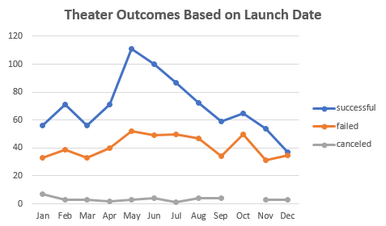
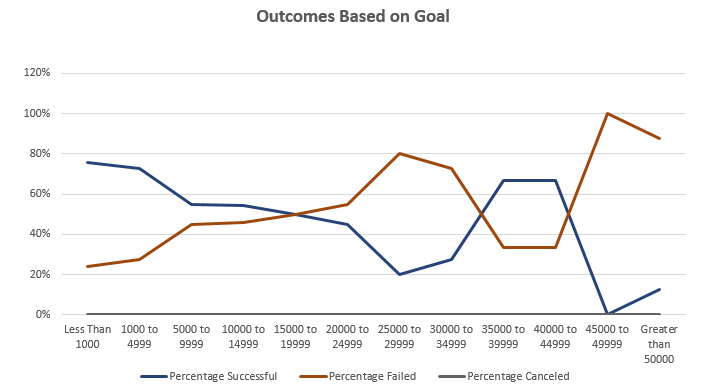

# An Analysis of Kickstarter Campaigns

## Overview of Project

The Kickstarter analysis is performed via request from Louise, a young entrepreneur who launched a Kickstarter for a workshop production of ‘Fever’ back in June 2016. Although the campaign initially garnered a welcoming support from her close family and friends, it came just short of the initial campaign goal of $2,885 due to lack of public backing.

### Purpose

The purpose of this analysis is to help provide appropriate comparison that Louise can compared her campaign, the production of ‘Fever’. Through this analysis, Louise would gain greater understanding about whether her decision to launch the Kickstarter in June played a favorable/unfavorable role in her campaign outcome. Additionally, she would be able to understand whether her campaign goal is a realistic chance of potentially reaching its target.

## Analysis and Challenges

### Analysis of Outcomes Based on Launch Date

Out of 1,369 Theater related Kickstarter campaigns launched between 2009 and 2017, 457, or 33% were launched during the period May-Jul. While our preconceived notion made lead us to expect lower success rate due to higher competition within the theater campaign category, the result actually suggests otherwise: May-Jul posted the highest average success rate (65%) for any consecutive three-month period. For us, it indicates a public interest and positive demand for theater related campaign during the summer season.

### Analysis of Outcomes Based on Goals

The distribution of Theater-Plays Kickstarter campaign based on goal$ follows a right-skewed bell-curve, with the higher number of campaigns peaked at $1,000 to $4,999 that slowly taper-off as the goal value increases. Out of 1,047 Kickstarter campaigns, 51% (534) of the campaigned were had an initial goal between $1,000 to $4,999. Louise’s Kickstarter also falls under this goal category.
	
By calculating the success/fail rate for each of the goal category and graphing the rate by category appropriately, one can observe a downward sloping success rate trend as goal amount increases, followed by a surprising uptick in rate as goal amount reaches $25,000 and greater. Given the number of campaigns with goal over $25,000 only accounts for 4% of the total data set, we advise to only focus on the campaigns below the said threshold to ensure higher accurate. 

Excluding category over $25,000 goal amount, the success rate trend exhibits a negative slope, which indicates a higher chance for a Theater-Plays campaign to reach its goal the lower the initial monetary expectation is. The success rate is the highest one the goal was set below $1,000 at 76%, and it’s closely followed by campaign with goal between $1,000 to $4,999 at 73%.

### Challenges and Difficulties Encountered

Personally, the challenging part about this assignment is about forming an overall narrative and stringing analysis together to better explain a prompt. The technical piece of compiling the table, graphing the charts are relatively easy to follow. However, being able make several isolated observations about a dataset doesn’t equates to good analysis. Most of my energy is put into structuring which observation would relate to other ones and hoping to find a coherent narrative that would make sense to the potential reader.  
	

## Results

***What are two conclusions you can draw about the Outcomes based on Launch Date?***

Drawing from the analysis above, Louise decision to launched her ‘Fever’ campaign in June 2016 was a favorable one, and should ensure the production would have a higher chance to reach a successful outcome given the general interest and demand. With that said, the unsuccessful outcome of her campaign should be attributed to some other factor other than the date of launch.

***What can you conclude about the Outcomes based on Goals?***

Based on the graph above, close to 73% of the campaigns that launched with the initial goal of $1,000 to $4,999 were successful, but unfortunately, Louise’s ‘Fever’ campaign was not one of it. Given the general public acceptance and willing to pledge for similar campaign type with similar backing requested, Louise’s unsuccessful Kickstarter campaign should not be attributed to it monetary goal, and should be attributed to some other factors.   

***What are some limitations of this dataset?***
	
1.	Period Covered: Given the period covered with the dataset is only between 2009 and 2017, any conclusion drawn to help with campaign today (2020) might be flawed due to changes in overall public interest (for example) that might have occurred in the last several years.

2.	Actual Cause for Success/Failure of a Campaign: Although this dataset might help future entrepreneur in determining the most favorable quantitative detail of his endeavor based on historical average/trend, it missed out on capturing the qualitative feature (harder to capture) that could ensure better chances for success. When it gets down to the basic, the content of the campaign (product offered, quality of product, and etc) should be the most determining factor that dictates success and failure.
	

***What are some other possible tables and/or graphs that we could create?***
	
Bar chart showing the most favorable to least favorable category by pledged amount by country. This could potentially be expanded by adding date series to see if public interest for certain category of Kickstarter campaign has shifted over time or not.

Exploring the relationship between the length of the campaign to success rate by bucketing different length of campaign (for example, less than 1 month, 1-3 months, 4 – 6 month…) and calculating the success rate of each category. A histogram or line graph (similar to Deliverable #2) can be compiled.

